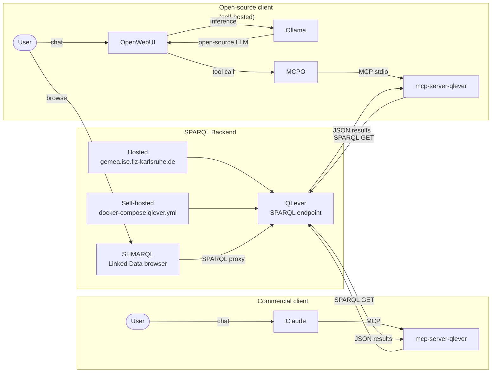

# GeMeA — German Memory Atlas

GeMeA is a knowledge graph over approximately 26.8 million digitised objects from the [German Digital Library](https://www.deutsche-digitale-bibliothek.de/) (DDB), aligned to the [mocho](https://github.com/ISE-FIZKarlsruhe/mocho) mid-level ontology and indexed in [QLever](https://github.com/ad-freiburg/qlever) for high-performance SPARQL querying.
The corpus is served through [SHMARQL](https://github.com/epoz/shmarql) as a dereferenceable Linked Data browser and SPARQL endpoint, and is queryable by AI agents via [mcp-server-qlever](https://github.com/xorwell/mcp-server-qlever).

> Supplemental materials for: Mary Ann Tan, Genet Asefa Gesese, Harald Sack. **GeMeA: A Knowledge Graph for the German Digital Library.** *ISWC 2026 Resource Track* (forthcoming).

---

## Downloads & endpoints

| Resource | URL |
|---|---|
| GeMeA N-Quads dump | <https://gemea.ise.fiz-karlsruhe.de/downloads/gemea> |
| Goethe-Faust corpus (JSONL + N-Quads) | <https://gemea.ise.fiz-karlsruhe.de/downloads/goethe-faust/> |
| SHMARQL Linked Data browser | <https://gemea.ise.fiz-karlsruhe.de/shmarql> |

---

## Resource statistics

Object and triple counts per sector (as of ISWC 2026 submission). ⚠️ Updated stats after ironing kinks — see table below.

| Sector | Objects | Total triples | DDB-EDM | MOCHO | PROV |
|---|---:|---:|---:|---:|---:|
| Library | 18,338,116 | 1,930,178,220 | 1,040,390,087 | 356,952,292 | 532,835,841 |
| Archive | 3,456,119 | 467,439,123 | 259,483,277 | 61,795,115 | 146,160,731 |
| Museum | 2,011,841 | 230,484,127 | 123,795,378 | 48,164,578 | 58,524,171 |
| Media Library | 1,709,846 | 258,176,923 | 145,905,243 | 58,871,240 | 53,400,440 |
| Research | 1,165,891 | 138,118,201 | 75,842,237 | 24,633,128 | 37,642,836 |
| Monument Preserv. | 79,393 | 9,020,751 | 4,852,432 | 1,555,297 | 2,613,022 |
| Others | 85,408 | 9,996,438 | 5,487,618 | 1,958,508 | 2,550,312 |
| **Total** | **26,846,614** | **3,043,413,783** | **1,655,756,272** | **553,930,158** | **833,727,353** |

Updated object and triple counts per sector (post-submission, after pipeline fixes).

| Sector | Objects | Total triples | DDB-EDM | MOCHO | PROV |
|---|---:|---:|---:|---:|---:|
| Library | 18,570,245 | 1,981,590,317 | 1,043,156,260 | 398,850,679 | 539,583,378 |
| Archive | 3,638,021 | 501,431,917 | 271,272,035 | 76,478,457 | 153,681,414 |
| Museum | 2,117,728 | 237,492,790 | 121,768,266 | 54,294,081 | 61,414,768 |
| Media Library | 1,799,838 | 263,104,795 | 142,865,860 | 64,023,886 | 56,215,049 |
| Research | 1,227,252 | 146,191,553 | 78,275,686 | 28,281,400 | 39,634,464 |
| Monument Preserv. | 83,572 | 9,628,501 | 5,086,627 | 1,789,244 | 2,752,630 |
| Others | 89,904 | 10,545,972 | 5,619,439 | 2,242,076 | 2,684,457 |
| **Total** | **27,526,560** | **3,149,985,845** | **1,668,044,173** | **625,959,823** | **855,966,160** |

The QLever index is organised into four named graphs:

| Named graph | Contents |
|---|---|
| `graph/ddbedm` | Verbatim EDM passthrough |
| `graph/mocho` | mocho-aligned triples |
| `graph/prov` | PROV-O provenance |
| `graph/work` | GND work links |

---

## Pipeline

**Ingest (build-time)**

```
DDB Search API ──► fetch IDs ──► fetch JSON records
                                       │
                                       ▼
                              SQLite (per sector)
                                       │
                         scripts/transform/ (Phase 1)
                         EDM → mocho alignment
                                       │
                                       ▼
                              N-Quads (named graphs)
                                       │
                              qlever index build
```

**Access (runtime)**



**Goethe-Faust POC.** The alignment and dispatch logic were developed and validated on the [Goethe-Faust corpus](goethe-faust/) — 115,432 DDB records retrieved via the keywords *Goethe* and *Faust* — before scaling to the full 26.8M-object collection. The corpus analysis scripts, outputs, and design decisions are in [`goethe-faust/`](goethe-faust/).

---

## Directory structure

```
gemea/
├── docker-compose.qlever.yml    QLever + SHMARQL + MCPO (SPARQL backend)
├── docker-compose.openwebui.yml OpenWebUI chat UI (open-source client)
├── docs/adr/                    Architecture Decision Records (transform)
│   ├── transform-adr.md         Class dispatch and WEMI alignment decisions
│   ├── transform-props-mapping-adr.md   Property mapping decisions
│   └── transform-script-adr.md  Transform implementation decisions
├── scripts/
│   ├── README.md                Transform → N-Quads → QLever workflow
│   ├── transform/               EDM → mocho transform package
│   └── config/                  Lookup tables consumed by transform
├── goethe-faust/                Goethe-Faust reference corpus
│   ├── scripts/                 Data acquisition + corpus analysis scripts
│   ├── output/                  Corpus analysis outputs (CSVs, PNGs, JSONs)
│   └── data/                    Corpus sample (IDs + 1K-record excerpt)
├── paper/
│   └── iswc-2026.pdf            Submitted paper
├── CITATION.cff
└── LICENSE                      MIT (code) / CC BY 4.0 (data)
```

---

## Self-hosting

The SPARQL backend (QLever + SHMARQL) is available at `https://gemea.ise.fiz-karlsruhe.de` — no setup required to query it. For the LLM client, choose between a commercial option (Claude) or a fully open-source option (Ollama + OpenWebUI). Both can also be combined with a self-hosted SPARQL backend.

### SPARQL backend (optional — skip if using the hosted VPS)

Requires Docker and Docker Compose.

**1. Download the N-Quads dump**
```bash
wget https://gemea.ise.fiz-karlsruhe.de/downloads/gemea/{yyyymmdd}/nq/*.nq
```

**2. Configure**
```bash
cp goethe-faust/config.env.example config.env
# Set NQ_INPUT_DIR, INDEX_DIR, and ports in config.env
```

**Before running**
- [ ] `NQ_INPUT_DIR` exists and contains `gemea.nq`
- [ ] `INDEX_DIR` exists and the Docker user (UID 1000) has write access
- [ ] Ports `QLEVER_PORT`, `SHMARQL_PORT`, and `MCPO_PORT` are free on the host

**3. Start**
```bash
docker compose --env-file config.env -f docker-compose.qlever.yml up -d --wait
```

SPARQL endpoint: `http://localhost:7030` · SHMARQL browser: `http://localhost:7032` · MCPO: `http://localhost:8001` (defaults; adjust in `config.env`).

### LLM client

Independent of whether you use the hosted or self-hosted SPARQL backend. Replace `<qlever-host>` with `gemea.ise.fiz-karlsruhe.de` (hosted) or `localhost` (self-hosted).

**Option A — Commercial (Claude)**

Add to `.claude/settings.json`:
```json
{
  "mcpServers": {
    "gemea-qlever": {
      "command": "docker",
      "args": ["run", "--rm", "-i",
               "ghcr.io/xorwell/mcp-server-qlever:latest",
               "-e", "http://<qlever-host>:7030"]
    }
  }
}
```

**Option B — Open-source (Ollama + OpenWebUI)**

Ollama must run natively on macOS — Docker Desktop does not expose Apple Silicon GPU (Metal) to containers.

1. Install [Ollama](https://ollama.com/download) and pull a model: `ollama pull gemma4:e4b`
2. Start OpenWebUI: `docker compose -f docker-compose.openwebui.yml up -d`
3. Open `http://localhost:3000` and create an admin account
4. Go to **Admin → Settings → Tools** and add the MCPO tool server URL: `http://<qlever-host>:8001`

---

## License

| Component | License |
|---|---|
| Code (scripts, transform) | [MIT](LICENSE) |
| Data (corpus, KG dump) | Per object — queryable via `dcterms:rights` |

---

## Troubleshooting

**T1. `Permission denied` writing to `/data`**
The Docker user cannot write to `INDEX_DIR`. Check that the directory exists and is writable:
```bash
mkdir -p $INDEX_DIR && chmod 777 $INDEX_DIR
```

**T2. `invalid spec: :/input:ro` — empty section between colons**
`NQ_INPUT_DIR` is not set. Verify `config.env` contains a valid path.

**T3. `ERROR: no files matched /input/*.nq`**
No `.nq` file in `NQ_INPUT_DIR`. Confirm `gemea.nq` is in that directory.

**T4. Port already in use**
Change `QLEVER_PORT` or `SHMARQL_PORT` in `config.env` to a free port.

**T5. `dependency failed to start`**
Root cause is always in the QLever logs:
```bash
docker compose --env-file config.env -f docker-compose.qlever.yml logs qlever
```

---

## Caveats

- The Goethe-Faust POC covers 115,432 records; the full GeMeA corpus covers 26.8M objects.
- GND Werk linking (Phase 1b) is partial; the `graph/work` named graph may be incomplete.
- NER enrichment (Phase 2) is deferred and not included in this release.
- Resource metadata (VoID descriptor, DCAT record, persistent URI) will be added at camera-ready.

---

## Citation

```bibtex
@inproceedings{tan2026gemea,
  author    = {Tan, Mary Ann and Posthumus, Etienne and Gesese, Genet Asefa and Sack, Harald},
  title     = {{GEMEA: An Open Knowledge Graph over 26M+
German Cultural Heritage Objects}},
  booktitle = {{Proceedings of the 23rd International Semantic Web Conference (ISWC 2026)}},
  year      = {2026},
  note      = {Resource Track. Forthcoming.},
}
```
